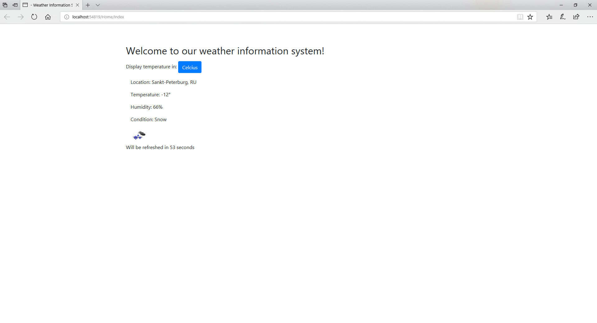

# DemoProject

This project demonstrates how you can display weather information from OpenWeatherMap.org.
Development has been done in Visual Studio 2017, the .NET Framework version is 4.6.1.

Getting the project: git clone https://github.com/Alexey-Vasilyev/DemoProject

Build and run:
Open the WeatherInfoSystem.sln in VS 2017, build it and run (hit F5).

Time spent on the project: 4 hours

Additional notes: The application has been tested in MS Edge and Chrome browsers. Screenshot Weather.png shows a sample of the displayed data.

